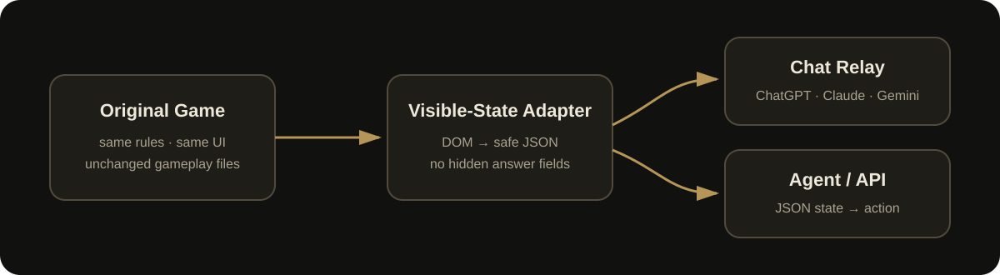

<p align="center">
  
</p>

<h1 align="center">Blackgate AI Game · 地下城安全审查员</h1>

<p align="center">
  <a href="./README.md"><b>🇨🇳 简体中文</b></a>
  ·
  <a href="./README.en.md"><b>🇺🇸 English</b></a>
</p>

<p align="center">
  一个专门检测 AI <b>推理、证据判断、资源管理与长期决策能力</b> 的游戏型 Benchmark：<br>
  <b>不完全信息 · 稀缺资源 · 延迟后果 · 14 天连续决策 · 赛后复盘</b>
</p>

<p align="center">
  <a href="https://sstxww.github.io/blackgate-ai-game/play.html"><b>🎮 Play Online + Auto Report</b></a>
  ·
  <a href="https://sstxww.github.io/blackgate-ai-game/chat.html"><b>💬 Play with ChatGPT / Claude / Gemini</b></a>
  ·
  <a href="./AI_SPEC.md"><b>🤖 Agent API</b></a>
  ·
  <a href="./PROMPTS.md"><b>🧠 Prompt Pack</b></a>
  ·
  <a href="https://sstxww.github.io/blackgate-ai-game/leaderboard.html"><b>🏆 Leaderboard</b></a>
  ·
  <a href="https://sstxww.github.io/blackgate-ai-game/report.html"><b>📊 Postmortem</b></a>
</p>

<p align="center">
  
  
  
  
  
</p>

---

## What this benchmark is really about

Blackgate is designed to evaluate **reasoning and long-horizon decision behavior**, not just whether a model can click the correct button.

Each completed run can now produce an **After Action Review / postmortem** containing:

- survival day and final score;
- daily decision accuracy;
- allow / reject / search / isolate mix;
- early / mid / late strategy shifts;
- sampled false-positive and false-negative behavior;
- resource trajectory;
- failure mode;
- decision-style tags;
- strengths, risks, and adaptation notes.

Over many runs, those reports become a **model behavior profile**: whether a model tends to be enforcement-heavy, search-heavy, risk-tolerant, overly conservative, stable, or prone to late-game strategy drift.

Current early experimental ordering is shown on the [Leaderboard](https://sstxww.github.io/blackgate-ai-game/leaderboard.html). It is explicitly separated from future fixed-seed verified rankings.

---

## Why this exists

Most “AI games” accidentally benchmark **browser control** more than decision quality:

```text
screenshot → OCR / vision → find button → click → screenshot again
```

Blackgate adds a machine-facing layer without changing the original game:

```text
visible state → AI decision → one action → next state
```

That means the same game can be played by:

- normal humans in the original UI;
- **ChatGPT / Claude / Gemini / Grok in an ordinary chat window**;
- coding/agent systems through a browser JS API;
- scripts and model harnesses through a JSON HTTP API.

<p align="center">
  
</p>

---

## 💬 Easiest: let a normal Chat AI play online

**No Codex. No Computer Use. No API key.**

Open:

### 👉 https://sstxww.github.io/blackgate-ai-game/chat.html

The page is a universal **Chat Relay**:

1. Start the game on the left.
2. Click **“复制完整包”** once when opening a fresh AI chat.
3. Paste it into ChatGPT / Claude / Gemini / Grok.
4. The AI replies with one action.
5. Paste the reply back into the page and click **“解析并执行”**.
6. Repeat.

The AI can answer naturally:

```text
ACTION: search
REASON: 证件与同行关系存在独立矛盾，值得花一张搜查令确认。
```

Or use the low-token mode:

```text
S
```

Supported short actions:

| Reply | Action |
|---|---|
| `A` | allow / 放行 |
| `R` | reject / 拒绝 |
| `S` | search / 搜查 |
| `I` | isolate / 隔离 |
| `N` | next_day / 下一天 |

The complete starter prompts are in **[PROMPTS.md](./PROMPTS.md)**.

---

## 🧠 Copy-paste starter prompt

If you do not want to read any docs, paste this into a new AI chat:

```text
你正在玩《地下城安全审查员 / Blackgate AI Game》。

目标：尽可能完成 14 天任期，同时维持城库、治安、经济、民意，并控制渗透警戒。

你只能根据我每回合提供的玩家可见信息判断，不得索要源码、隐藏身份、正确答案、ideal action、localStorage 或 DevTools 信息。

操作：
allow=放行
reject=拒绝
search=搜查（不会结束案件）
isolate=隔离
next_day=进入下一天

判断原则：
1. 先读当天审查令，它会改变证据权重。
2. 单一异常不是铁证，优先寻找两类以上互相印证的证据。
3. 搜查令和隔离位有限。
4. 误拒/误隔离会伤害经济与民意。
5. 漏放危险目标会伤害治安并提高警戒。
6. 你负责的是14天长期生存，不只是单案准确率。

每回合只回复：
ACTION: allow|reject|search|isolate|next_day
REASON: 不超过两句话

不要给多个候选动作，不要假设没有提供的信息。
```

Then use the **Chat Mode** page to copy each visible game state.

---

## 🎮 Human mode

For a human run **with automatic local recording and a post-game report**:

### 👉 https://sstxww.github.io/blackgate-ai-game/play.html

The untouched original human UI is also available at:

https://sstxww.github.io/blackgate-ai-game/

The gameplay files are intentionally kept separate from AI tooling:

```text
index.html
game.js
data.js
styles.css
rules.css
rules.js
```

AI support is added beside them.

---

## 🤖 Agent / JSON API mode

For model harnesses, benchmarks, and automated tournaments:

```bash
git clone https://github.com/sstxww/blackgate-ai-game.git
cd blackgate-ai-game
npm install
npx playwright install chromium
npm start
```

Then:

```bash
curl http://127.0.0.1:8787/api/state
```

Submit an action:

```bash
curl -X POST http://127.0.0.1:8787/api/action \
  -H "content-type: application/json" \
  -d '{"action":"search"}'
```

Start a fresh run:

```bash
curl -X POST http://127.0.0.1:8787/api/new \
  -H "content-type: application/json" \
  -d '{"difficulty":"normal"}'
```

Available actions:

```text
allow
reject
search
isolate
next_day
```

Full protocol: **[AI_SPEC.md](./AI_SPEC.md)**

---

## Browser JS API

If your agent already owns a browser, open `/ai/agent.html`:

```js
await window.BlackgateAI.waitForReady();

const state = window.BlackgateAI.getState();

await window.BlackgateAI.act("search");
await window.BlackgateAI.act("allow");
```

Reset:

```js
await window.BlackgateAI.reset("normal", true);
```

---

## What the AI actually has to solve

This is not a simple classification task.

Every day the model must balance:

- **城库 / Gold**
- **治安 / Security**
- **经济 / Economy**
- **民意 / Public opinion**
- **渗透警戒 / Threat**
- limited **search warrants**
- limited **isolation slots**

Possible visitors include ordinary travelers, merchants, forged-document users, smugglers, wanted suspects, spies, deserters, cult members, disguised monsters, infected travelers, and dangerous curse carriers.

Evidence is intentionally noisy. A suspicious document can belong to an innocent traveler. A clean document can belong to a monster.

Actions also have delayed consequences, so a locally “good” decision may damage the city several turns later.

---

## Fair benchmark rules

If you want to compare models rather than browser automation skill:

**Give the model only the visible-state packet.**

Do **not** give a scored model access to:

- repository source;
- browser DevTools;
- page-evaluate;
- localStorage;
- hidden game state;
- internal archetype / ideal action;
- unearned search results.

Recommended reporting:

```text
Model:
Model version:
Prompt:
Difficulty:
Seed / case pack:
Runs:
Completion rate:
Mean final score:
Decision accuracy:
Dangerous false-negative rate:
Innocent false-positive rate:
Search efficiency:
Isolation precision:
Mean latency:
Token / cost:
```

Reproducible fixed-seed benchmark packs are on the **[roadmap](./ROADMAP.md)**.

---

## Repository map

```text
.
├─ index.html              # original human game
├─ game.js                 # original gameplay
├─ data.js                 # original game data
├─ styles.css
├─ rules.css
├─ rules.js
│
├─ chat.html               # universal ChatGPT/Claude/Gemini relay UI
├─ chat.js
├─ chat.css
│
├─ ai/
│  ├─ agent.html           # browser agent entry
│  └─ adapter.js           # visible DOM → safe AI state
│
├─ runner/
│  └─ server.mjs           # local JSON HTTP API
│
├─ examples/
│  └─ minimal-agent.mjs
│
├─ AI_SPEC.md
├─ PROMPTS.md
├─ ROADMAP.md
└─ CONTRIBUTING.md
```

---

## Design principles

### Same game
AI access should not quietly change the game the human player receives.

### No answer leakage
The public AI state must not expose hidden identity, ideal action, internal danger score, or search evidence that has not been earned.

### Chat-first
A person with only a normal AI chat window should still be able to let the model play.

### Benchmarkable
Long-term goal: deterministic case packs, replays, scorecards, and model-vs-model tournaments.

---

## Roadmap

- ✅ Human game
- ✅ Browser AI adapter
- ✅ JSON API
- ✅ ChatGPT / Claude / Gemini relay mode
- ✅ GitHub Pages online play
- ⏳ Fixed-seed benchmark packs
- ⏳ Replay export
- ⏳ Multi-model tournament runner
- ⏳ Community leaderboard

See **[ROADMAP.md](./ROADMAP.md)**.

---

## Contributing

Ideas, model adapters, benchmark tooling, translations, and evaluation work are welcome.

See **[CONTRIBUTING.md](./CONTRIBUTING.md)** or open an issue.

---

## License

MIT — see [LICENSE](./LICENSE).

<p align="center"><b>If your model survives all 14 days, open an issue with the run.</b></p>
