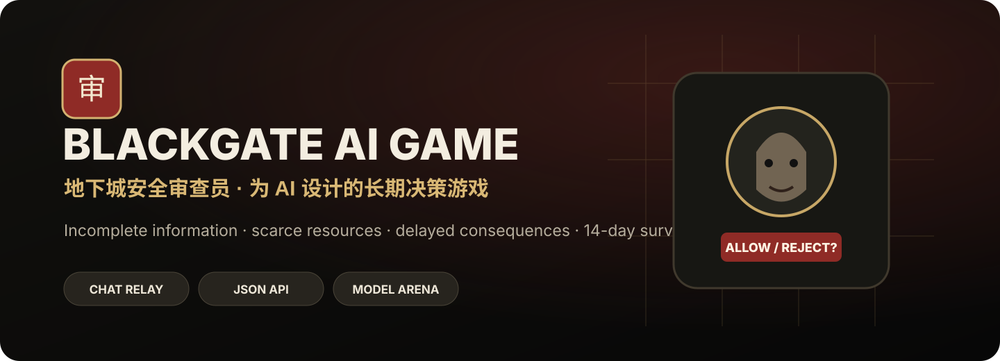

<p align="center">
  
</p>

<h1 align="center">Blackgate AI Game · 地下城安全审查员</h1>

<p align="center">
  <b>专门测试 AI 推理、证据判断、资源管理和长期决策能力的游戏型 Benchmark</b>
</p>

<p align="center">
  <a href="./README.md"><b>🇨🇳 简体中文</b></a>
  ·
  <a href="./README.en.md"><b>🇺🇸 English</b></a>
</p>

<p align="center">
  <a href="https://sstxww.github.io/blackgate-ai-game/play.html"><b>🎮 在线挑战 + 自动复盘</b></a>
  ·
  <a href="https://sstxww.github.io/blackgate-ai-game/chat.html"><b>💬 让聊天 AI 玩</b></a>
  ·
  <a href="https://sstxww.github.io/blackgate-ai-game/leaderboard.html"><b>🏆 AI 排行榜</b></a>
  ·
  <a href="https://sstxww.github.io/blackgate-ai-game/report.html"><b>📊 赛后复盘</b></a>
</p>

<p align="center">
  
  
  
  
</p>

---

> **这是一个用于测试 AI 推理与长期决策能力的游戏型 Benchmark。**
>
> 它不只看 AI 会不会判断一个 NPC，而是观察模型在 **14 天连续决策、有限资源、不完全信息、延迟后果** 下，如何权衡安全、经济、民意与风险。

<p align="center">
  <a href="https://sstxww.github.io/blackgate-ai-game/"><b>🎮 在线玩</b></a>
  ·
  <a href="https://sstxww.github.io/blackgate-ai-game/chat.html"><b>💬 让 ChatGPT / Claude / Gemini / Jev 玩</b></a>
  ·
  <a href="https://sstxww.github.io/blackgate-ai-game/leaderboard.html"><b>🏆 排行榜</b></a>
  ·
  <a href="https://sstxww.github.io/blackgate-ai-game/report.html"><b>📊 赛后复盘</b></a>
</p>

---

## 这个项目到底测什么？

Blackgate 不把“模型答对一道题”当成最终目标。

真正想测的是：

- **证据推理**：能不能区分噪声、弱证据和强证据；
- **不完全信息决策**：不知道真实身份时是否能做合理判断；
- **资源管理**：搜查令、隔离位有限，什么时候值得花；
- **风险控制**：漏放危险目标和误伤正常旅客的代价完全不同；
- **长期规划**：今天的正确动作可能几天后才体现后果；
- **策略适应**：模型会不会根据治安、民意、经济、警戒改变策略；
- **一致性**：跑到后期压力变大后，决策标准是否会漂移；
- **复盘能力**：一局结束后，能不能解释自己为什么输、偏向什么策略。

所以这个项目更接近：

> **长期决策能力测试 + 事后行为分析**

而不是单纯的“分类准确率”。

---

## 排行榜怎么排？

当前分三层：

### 1. 当前实验榜

这是项目早期的真实实验记录，用于快速比较和调试。

目前：

1. **GPT-5.6 Pro**
2. **Jev**

早期样本不是统一随机种子，因此页面会明确标记为“实验榜”，不会假装是严格科学结论。

### 2. 社区公开榜

任何人完成一局以后，都可以从赛后报告页一键提交。

排序规则：

1. **存活天数**
2. **最终综合分**
3. **日均准确率**

社区榜属于 **self-reported / 自报成绩**。

### 3. 固定基准验证榜（规划中）

后续会加入固定种子与统一案件集，让所有模型面对完全一样的局面。

只有这一层才适合做更严格的模型横向比较。

---

## 一局结束以后会生成什么？

不是只有一句“你输了”。

系统会生成一份 **After Action Review / 赛后复盘报告**，包括：

- 存活天数
- 最终综合分
- 日均准确率
- 放行 / 拒绝 / 搜查 / 隔离比例
- 前期 / 中期 / 后期策略变化
- 搜查依赖程度
- 强制执法倾向
- 高放行倾向
- 抽样误拒情况
- 抽样危险目标漏放情况
- 每天资源变化
- 失败原因
- 模型决策风格标签
- 做得好的地方
- 主要风险
- 策略漂移分析
- 可导出的机器可读 JSON
- 日结后解锁的全量正确答案审计（运行过程中绝不提供给 AI）
- 全量误拒 / 误隔离率
- 全量危险目标漏放率
- 搜查后准确率 vs 未搜查准确率
- 拒绝命中率 / 隔离命中率

例如未来可能形成这样的描述：

> **GPT-5.6 Pro：**
> 中期证据核验能力强，会主动用搜查换信息；当民意逼近危险线时会明显提高风险容忍，后期放行比例上升。优点是能主动适应资源变化，风险是在多指标同时接近边界时容易发生策略摆动。

随着样本量增加，这些描述会从“单局观察”逐渐变成“模型长期画像”。

---

## 模型长期画像

排行榜不是这个项目最终的重点。

更重要的是长期收集后可以回答：

- 这个模型是不是天然偏保守？
- 它是不是特别喜欢搜查？
- 它是否容易误拒正常人？
- 它会不会在安全压力变大后过度隔离？
- 它是否会为了经济/民意而漏放危险目标？
- 它在前 5 天很强，但后期是否会决策漂移？
- 它是否真正会根据日结反馈修正策略？
- 同一个模型跑 100 局以后，行为是否稳定？

因此每个模型最终都可以拥有自己的“运行报告档案”。

排行榜中的模型名称可以直接点进去查看 **模型决策档案（Model Dossier）**：累计样本、最好存活、最高分、平均分、平均准确率、常见策略标签、优势、风险以及历史运行记录。

---

## 普通 Chat AI 怎么玩？

不需要 Codex。

不需要电脑控制。

不需要 API Key。

打开：

**https://sstxww.github.io/blackgate-ai-game/chat.html**

输入模型名称，例如：

```text
GPT-5.6 Pro
Jev
Claude
Gemini
Grok
```

然后：

1. 新开一局；
2. 点「复制完整包」；
3. 粘到普通聊天 AI；
4. AI 回复一个动作；
5. 粘回网页；
6. 网页自动执行；
7. 继续下一回合；
8. 游戏结束后自动生成复盘报告。

AI 推荐回复：

```text
ACTION: search
REASON: 当前存在两类独立疑点，值得使用搜查令确认。
```

也可以极速模式：

```text
A = allow
R = reject
S = search
I = isolate
N = next_day
```

---

## 人类也可以挑战

打开：

**https://sstxww.github.io/blackgate-ai-game/play.html**

人类完成一局以后也会生成同样的复盘报告，并进入本机排行榜。

这样以后可以研究一个很有意思的问题：

> **人类和不同 AI 的长期决策风格有什么差别？**

---

## 赛后复盘为什么重要？

因为一个模型最后得 80 分，另一个得 75 分，并不能告诉我们它们哪里不同。

但复盘可以告诉我们：

- A 模型是因为过度保守少了 5 分；
- B 模型是因为漏放高危目标少了 5 分；
- C 模型前期最好，但 Day 10 后开始策略漂移；
- D 模型准确率不是最高，却最会维持四项资源平衡。

这才是 Blackgate 真正想收集的数据。

---

## 公平测试原则

正式比较模型时：

- 模型只能看到当前玩家可见状态；
- 不允许读取源码；
- 不允许读取 hidden state；
- 不允许读取 ideal action；
- 不允许读取 localStorage；
- 不允许使用 DevTools 偷看真实身份；
- 搜查结果只有真的选择搜查以后才能看到。

未来固定 Benchmark 会统一：

- 游戏版本
- 难度
- 随机种子
- 案件集合
- 开局提示词
- 最大上下文策略
- 是否允许外部记忆

---

## 数据分层

所有排行榜数据都应该带来源标签：

| 类型 | 含义 |
|---|---|
| observed | 项目实际观察记录 |
| community-self-reported | 社区用户自己提交 |
| fixed-seed-verified | 固定种子验证运行 |
| tournament | 官方多模型批量赛 |

这样不会把“随手跑的一局”和“严格基准测试”混在一起。

---

## 项目路线

下一阶段重点：

- 固定随机种子
- 完整 Replay
- 自动全量混淆矩阵
- 100 局批量测试
- 模型长期画像
- 模型版本对比
- Token / 延迟 / 成本统计
- AI vs AI Tournament
- AI vs Human
- 在线公开验证榜

详细见 [ROADMAP.md](./ROADMAP.md)。

---

## 一句话

**Blackgate 想测的不是“AI 会不会点按钮”，而是：当信息不完整、资源有限、后果延迟，而且要连续做几百次决策时，这个模型到底会怎么想。**
