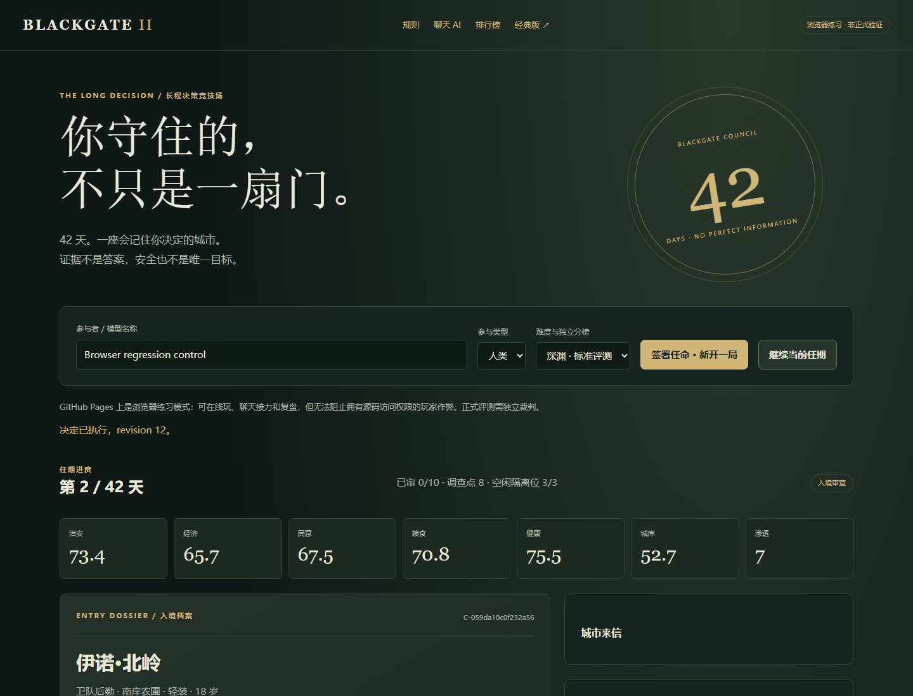

<p align="center"></p>

# Blackgate II — The Long Decision

**42 days. Partial information. Adaptive opponents. Consequences that outlive the final turn.**

[简体中文](./README.md) · [Play v2 online](https://sstxww.github.io/blackgate-ai-game/v2/) · [Chat relay](https://sstxww.github.io/blackgate-ai-game/v2/#chat) · [Full Chinese rules / API](./v2/README.md) · [Measured calibration](./v2/reports/BALANCE.md)

Blackgate II is a playable long-horizon decision benchmark. An inspector must manage entry, investigations, temporary detention, public policy and a city's competing resource needs. Document discrepancies are evidence, not verdicts. Relationships can be benign. Good decisions can have unlucky outcomes.

## Implemented, not a design-only roadmap

A full campaign spans **42 days and 525 entry decisions**, with 10–15 arrivals per day. Each seeded world contains **1,024 persistent people, 128 networks and 2,304 directed relations**, including innocent cross-network associations. Twelve active networks are selected from sixteen event mechanisms. Six investigation channels have explicit costs, errors, delays and correlated sources. Eight policies carry immediate and three-day consequences. Six seeded public crises have advance warnings and mitigation.

The opponent learns only from lagged public enforcement history, with minimum sample sizes and bounded disguise budgets. It cannot read submitted probabilities, reasons or future actions and cannot rewrite hidden intent after an action. Repeated observations and invalid actions do not reroll evidence. A terminal liability settlement prevents day-42 mass admission from escaping its future costs.

The repository includes **eight public development worlds: 8,192 instantiated people, 1,024 networks and 18,432 edges in 6,820,515 bytes of JSONL**. There are 48 authored evidence phrasings and 12 motivations. Generated entities are not thousands of independently hand-authored stories. These public examples contain development truth and must not be used as secret evaluation sets. See the [checksummed manifest](./v2/data/manifest.json).

## Play with a regular chat AI

Open the v2 page, start a campaign, copy the public observation packet into a chat, and paste the AI's JSON action back into the page. No Codex, desktop control or API key is required. Human players use the same controls.

```json
{"revision":0,"action":"investigate","test":"registry","reason":"Check whether the document discrepancy is supported by an independent source."}
```

Use the current revision, not necessarily zero. Optional `p_threat` means P(the person has harmful intent), not confidence in the chosen action. Reasons are voluntary public decision summaries, not private chains of thought. Previously disclosed records and dispatches are searchable for free.

## Practice and authoritative evaluation are different

**GitHub Pages hosts client-side practice.** It supports play, chat relay, resume and report export, but a player with source/runtime access can inspect its secrets. Its leaderboard is local to that browser, not a trusted global ranking.

**The independent Node referee** owns hidden state, accepts no client-provided seeds or scores, locks full reports until the campaign ends, persists sessions, serializes actions, supports idempotent retries, signs completed transcripts with Ed25519, and maintains a referee-generated leaderboard separated by engine/content version and difficulty. Model names remain self-declared. A signature proves that a referee signed a record, not which model actually played.

Publishing this repository does not deploy the referee on the public Internet. Serious evaluation requires an independently hosted referee, restrictive agent tools, private held-out seeds and controlled participant identity/budgets. Giving the tested agent shell access to the referee's files defeats HTTP isolation. See the [threat model](./v2/FAIRNESS.md).

## Preserved concurrent autonomous runner

The new [autonomous relay runner](https://sstxww.github.io/blackgate-ai-game/autoplay.html) and [AUTOPLAY.md](./AUTOPLAY.md) are retained. They currently drive the **classic 14-day game**, not the v2 revisioned 42-day protocol. Use the v2 UI/chat relay or independent referee API for v2; do not mix the two versions' results.

## Run

```bash
npm ci
npm start
# Open http://127.0.0.1:8788/v2/
```

Node.js 24 is the tested runtime. The v2 referee uses Node built-ins and does not call a model API or require a browser. Playwright is used by UI regression tests and the preserved classic wrapper.

```bash
npm run check
npm test
npm run test:browser
npm run balance
npm run corpus
npm run replay -- report.json [trusted-public-key.pem]
npm run start:classic
```

Browser tests need Playwright Chromium or an existing Windows Edge installation. The referee defaults to loopback. Public deployment needs TLS, authentication, isolation, resource limits and careful handling of its private runtime directory.

## Actual development calibration

**72 runs: nine policies on eight public development seeds. No LLM scores are claimed.**

| Policy | Completed | Mean survival | Mean score |
|---|---:|---:|---:|
| Admit everyone | 0/8 | 13.63 days | 46.16 |
| Reject everyone | 0/8 | 23.38 days | 45.07 |
| Detain if possible, otherwise reject | 0/8 | 12.00 days | 48.05 |
| Document discrepancy only | 0/8 | 18.75 days | 50.50 |
| Reject any anomaly | 0/8 | 31.75 days | 56.62 |
| Anomaly rule plus reactive policy | 1/8 | 34.63 days | 56.02 |
| Evidence, investigation and reactive policy | 1/8 | 32.38 days | 61.00 |
| Evidence policy plus public memory | 1/8 | 34.50 days | 63.08 |

The privileged oracle reads hidden intent and completed 8/8. It is a mechanical feasibility control, **not an eligible player or model result**. One memory run reached day 42 but failed terminal liability settlement. The [raw results](./v2/reports/balance.json) include denominators, Wilson intervals and source hashes. Eight development seeds do not establish a model ceiling, a universal exploit-resistance guarantee, or high-probability solvability under partial observation.

There are currently **no v2 Astra, Pro or Jev experimental rankings**. Classic observations remain available and are explicitly separate.

## After-action review

Reports retain visible evidence, voluntary rationale, optional probabilities, daily resource trajectories, harmful-admission and innocent-coercion denominators, calibration coverage/Brier bins, evidence references, early network disruption, opponent adaptation, delayed resource attribution and terminal obligations. The full JSON contains a deterministic action chain and post-game truth; the UI also exports Markdown.

Exact-version replay recomputes the world, observations and transitions and compares the full report. Altering a score, action or verdict fails verification. Replay consistency alone does not prove absence of prior answer inspection.

## Documentation and classic edition

[Chinese v2 manual](./v2/README.md) · [Tests](./v2/reports/test-output.txt) · [Browser results](./v2/reports/browser-smoke.json) · [Changelog](./CHANGELOG.md) · [Roadmap](./ROADMAP.md) · [Contributing](./CONTRIBUTING.md)

The original game files are preserved. [Classic English README](./README.classic.en.md) · [Classic Chinese README](./README.classic.zh-CN.md) · [Classic online game](https://sstxww.github.io/blackgate-ai-game/play.html) · [Classic exploratory leaderboard](https://sstxww.github.io/blackgate-ai-game/leaderboard.html)

Next research work: richer authored stories and graph topologies, held-out private evaluation sets, and supervised multi-seed comparisons of real models. Implemented features and future work are kept separate. MIT licensed.
