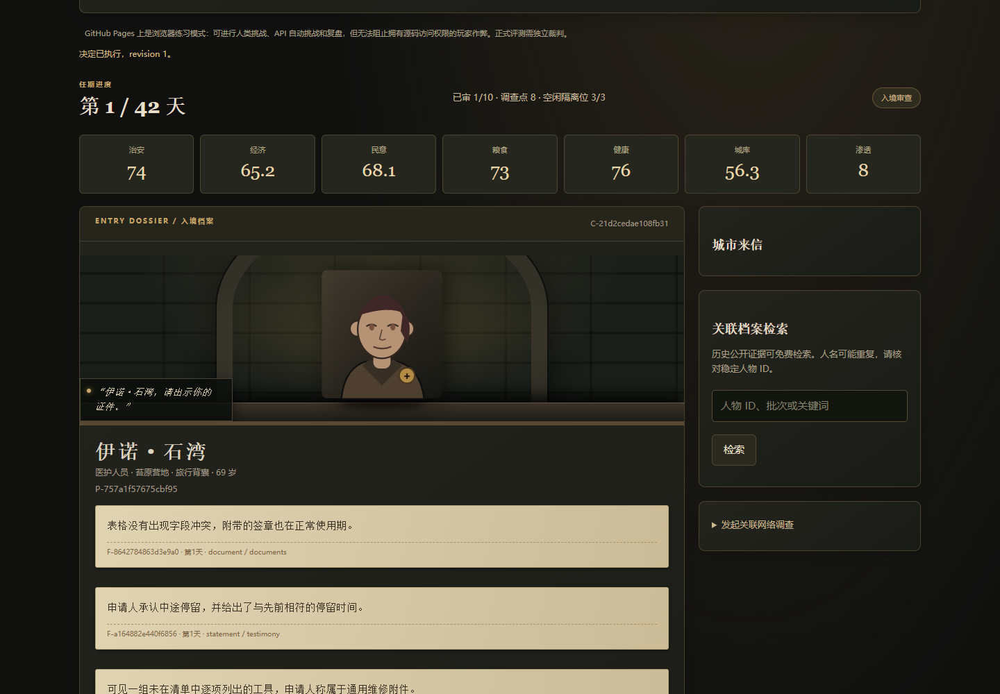

<p align="center"></p>

<h1 align="center">Blackgate II · 地下城安全审查员</h1>
<p align="center"><b>42 天 · 不完全信息 · 会适应你的对手 · 必须偿还的长期后果</b></p>
<p align="center"><a href="./README.md">简体中文</a> · <a href="./README.en.md">English</a></p>
<p align="center"><a href="https://sstxww.github.io/blackgate-ai-game/challenge.html?mode=human"><b>🎮 人类挑战</b></a> · <a href="https://sstxww.github.io/blackgate-ai-game/challenge.html?mode=ai"><b>🤖 API 自动 AI 挑战</b></a> · <a href="https://sstxww.github.io/blackgate-ai-game/challenge.html#board"><b>🏆 排行榜</b></a> · <a href="./WEB_ARENA.md"><b>📖 网页使用说明</b></a></p>
<p align="center">  </p>

> **守住一扇门不难。守住一座仍然值得生活的城市，才是考验。**
>
> 你每天只掌握有限证据，必须决定谁能进入、谁需要调查、何时值得花费资源，以及哪项政策能让城市撑过下一场危机。世界会记住你的决定，但不会在你落子之后改写答案。

## 这次不是给旧版简单加关

新版从经典版 14 天延展为 **42 天动态任期**。每天 10～15 名入境者，完整任期 525 次入境决策。难度来自证据冲突、跨日关系、有限调查预算、延迟因果、对手适应和多资源权衡，而不是无限增加阅读量。

| 能力 | 已实现的机制 |
|---|---|
| 长期记忆与关系推理 | 每局 1,024 人、128 个网络、2,304 条关系；历史公开档案和城市来信可检索 |
| 不确定性判断 | 文书差错可能无辜；6 类调查有误报、漏报和相关来源；生物阴性不排除其他威胁 |
| 信息价值决策 | 每日 8～10 调查点；深检、档案、证人与两日跟踪竞争同一预算 |
| 策略适应 | 对手只观察滞后的公开执法历史，受最小样本和改装额度约束，不读取理由或概率 |
| 长期规划 | 8 项政策含当日与三日后效果；供给、危害、网络与危机能相互影响 |
| 反投机 | 全放/全拒/隔离有系统代价；第 42 天后仍清算已承诺责任 |
| 可复核复盘 | 公开决策摘要、概率校准、证据引用、逐项后果归因、动作链和确定性重放 |

### 数据不是只有几张固定 NPC 卡

仓库附带 **8 个公开开发世界**，合计 **8,192 名人物实例、1,024 个网络、18,432 条关系**，约 6.82 MB JSONL；完整清单和每个文件的 SHA-256 在 [数据 manifest](./v2/data/manifest.json)。

另有 16 种事件机制、48 种证据表述、12 种自述背景，以及运行时生成器。**这些是程序生成的关系世界实例，不是假称几千道手写剧情。** 公共实例供开发、审计和测试使用；正式裁判使用新生成的私有种子，不抽取公开答案。

## 两种挑战方式，一个完整游戏

**人类挑战：** 输入昵称，开始执勤。原版人物、审查桌、纸质档案与环境音乐回归；点击右上角开启音乐。

**AI 挑战：** 填中转站 URL 与 API Key → 获取模型 → 选择模型和推理等级 → 开始。AI 会自动调查、检索历史、做决定、制定政策、推进下一天并生成复盘，不再需要复制粘贴接力。

支持实时模型列表，不限制国内外模型品牌；适配 Chat Completions、Responses、Anthropic Messages 和 Gemini 原生协议。具体服务商需允许浏览器 CORS，模型也必须支持所选参数。高级连接设置、难度与自定义提示词默认折叠。

**本项目不保存 API Key。** Key 仅留在页面内存和发往用户所选服务商的请求头中，不进入本机日志、报告、排行榜或 GitHub。页面会提示计费、跨域和档位限制，不把不支持的档位偷偷降级。详见 [网页操作、密钥隐私与兼容边界](./WEB_ARENA.md)。

## 在线练习 ≠ 服务端验证

| 模式 | 现在可用 | 成绩性质 |
|---|---|---|
| GitHub Pages 新版 | 人类挑战、API 自动 AI、报告导出、本机榜与公开社区自报榜 | 不是服务端防作弊认证；公开摘要由用户主动在 GitHub 提交 |
| 独立 Node 裁判 | API、同源 UI、会话隔离、持久恢复、赛后签名、裁判本地共享榜 | 裁判生成的记录；参与者模型名称仍自报 |
| 严格公开模型赛事 | 尚未宣布正式结果 | 还需独立部署、统一预算与工具、保密留出种子和监督模型身份 |

**发布仓库和 Pages，不等于已经在互联网上部署独立裁判。** 正式评测不能把服务器文件系统或其他种子的答案提供给模型。详见 [公平性与安全边界](./v2/FAIRNESS.md)。

## 日志与排行榜

每步记录公开理由、威胁概率、证据引用、资源变化、请求耗时与服务商返回的 Token。完成后生成 JSON / Markdown 复盘并自动进入本机榜；公开社区榜通过用户主动提交 GitHub Issue 进行格式校验收录，不上传 Key、接口地址或完整日志。

人类与 AI、不同难度、引擎/内容版本分开；没有测试数据就不预排模型。社区榜是自报，不冒充正式认证。网页层与 v2/ 游戏机制独立维护，避免干扰并行功能开发。

## 引擎本地开发与回归

```bash
npm ci
npm start
```

打开 `http://127.0.0.1:8788/v2/`。自动测试环境为 Node.js 24。v2 裁判无需 Playwright 或模型 API；Playwright 用于浏览器测试与经典版包装层。

```bash
node --test scripts/relay-client.test.mjs  # 网页接口与密钥隔离
node scripts/arena-browser.test.mjs       # 自动循环/暂停/停止/手机布局
npm run check            # JavaScript 语法检查
npm test                 # 引擎、边界、签名、重放与 API 回归
npm run test:browser      # 桌面/手机宽度、聊天接力、恢复、导出
npm run balance          # 9 类基线 × 8 个开发种子
npm run corpus           # 重建公开开发数据和 SHA-256 清单
npm run replay -- report.json
npm run start:classic     # 保留的经典版与原 API，端口 8787
```

浏览器测试需要已安装的 Playwright Chromium；Windows 也可使用已有 Edge。独立裁判默认监听回环地址，不会自动暴露到公网。

## 真正跑过的开发校准

**72 局，不是某个 AI 模型的宣传分数。** 所有策略代码和逐局结果公开；8 个种子用于开发，不作为保密留出集。

| 策略 | 通关 / 8 局 | 平均存活 | 平均分 |
|---|---:|---:|---:|
| 全放行 | 0 / 8 | 13.63 天 | 46.16 |
| 全拒绝 | 0 / 8 | 23.38 天 | 45.07 |
| 隔离优先、满位则拒绝 | 0 / 8 | 12.00 天 | 48.05 |
| 只看证件差异 | 0 / 8 | 18.75 天 | 50.50 |
| 任何异常就拒绝 | 0 / 8 | 31.75 天 | 56.62 |
| 异常规则 + 动态政策 | 1 / 8 | 34.63 天 | 56.02 |
| 公开证据 + 调查 + 动态政策 | 1 / 8 | 32.38 天 | 61.00 |
| 上述策略 + 历史记忆 | 1 / 8 | 34.50 天 | 63.08 |

读取隐藏身份的 **oracle 作弊对照** 为 8/8，只用于检查机制可行性，绝不进入玩家或模型排行榜。有一次记忆基线到达 42 天，却因期末延迟责任未能算作通关。

完整分母、置信区间和源码哈希见 [校准报告](./v2/reports/BALANCE.md)。8 个种子不足以证明通关概率或任何模型的能力上限。**当前没有 Astra、Pro、Jev 的 v2 实测排名。**

## 赛后能看到什么

报告保留当时证据、公开理由和概率，以及后来发生的后果：日级资源变化、危险目标漏放率、无辜强制措施率、Brier 校准与预测覆盖、提前阻断网络、适应后漏放、期末清算和完整重放材料。所有比例提供分子/分母。

坏结果不自动等于坏决策；这里没有为每个局面伪造一个“唯一正确动作”。模型画像应建立在多局证据上，而不是一局胜负或几句漂亮解释上。

## 项目导航

- [新版完整中文说明与 API](./v2/README.md)、[公平性说明](./v2/FAIRNESS.md)、[开发数据清单](./v2/data/manifest.json)。
- [实际测试输出](./v2/reports/test-output.txt)、[浏览器测试记录](./v2/reports/browser-smoke.json)、[72 局原始记录](./v2/reports/balance.json)。
- [经典版中文说明](./README.classic.zh-CN.md)、[历史成绩数据](./data/community-runs.json)。原始代码与历史材料保留，但公开网页统一为人类 / API AI 两个入口。
- [贡献指南](./CONTRIBUTING.md)、[版本记录](./CHANGELOG.md)、[路线图](./ROADMAP.md)、[MIT 许可证](./LICENSE)。

**下一步的严肃工作：更丰富的人工剧情与网络拓扑、保密留出集、真实模型的多种子统一评测。已有功能和未完成研究会继续分开标注。**
