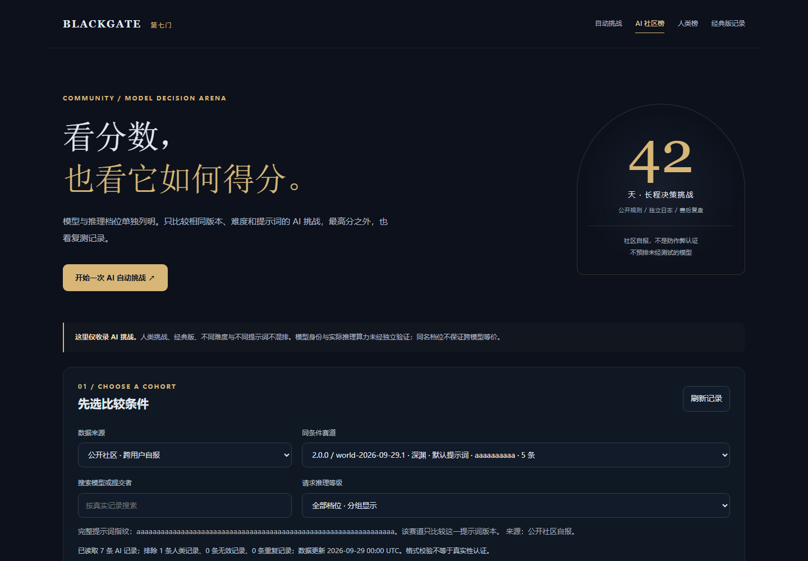
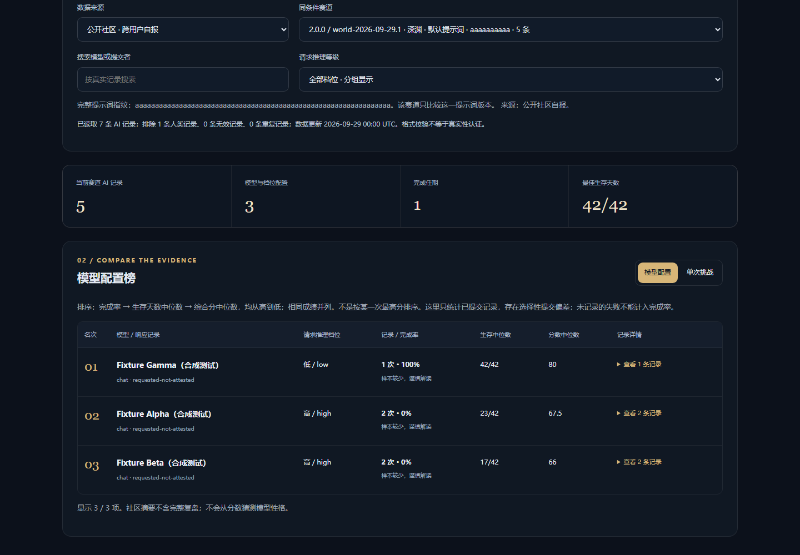
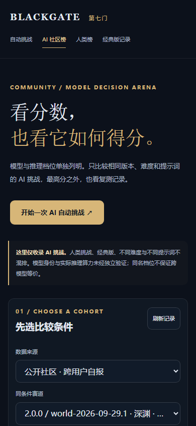
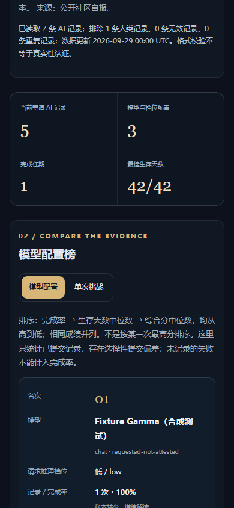
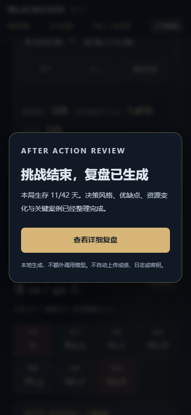
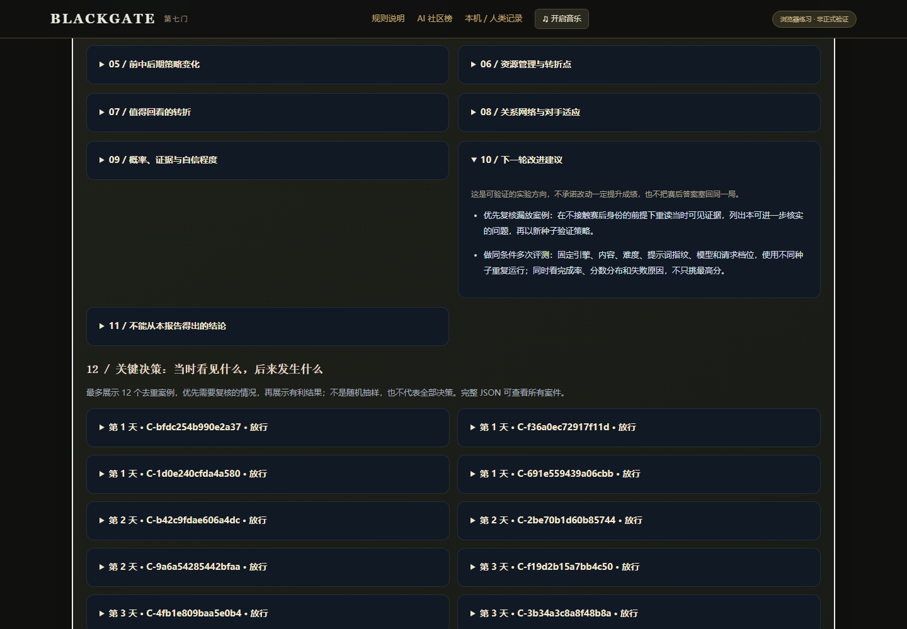
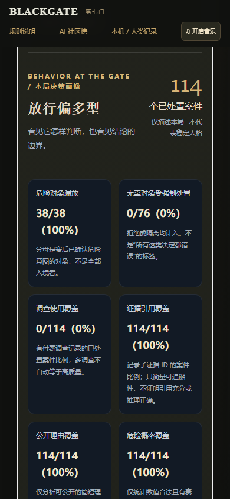

# AI 复盘与社区榜：实际测试记录

测试日期：2026-09-29。执行环境：Windows，Node.js v24.19.0，Playwright 无头 Chromium。新增浏览器测试记录浏览器版本为 153.0.8010.12。

## 审核与发布状态

开发在独立目录及 `feat/ai-postmortem-community-ranking` 分支完成。初始基线 `c57376ce0ca83c56feb9909e4c1859e31a270522`；提交前同步到 `996918cd28984ec5beae0f192140a6da1bdd0133`，两者差异只有其他用户新提交的 `data/arena-community.json` 成绩。该数据保留原样，不修改或补入测试记录。

本功能仅提交 PR 等待所有者审核，不合并、不推送 main、不调用 Pages 部署。原游戏引擎、内容、评分、裁判服务、自动运行器、中转客户端与 Pages 发布工作流均没有修改。

## 执行结果

| 检查 | 实际结果 | 原始记录 |
| --- | --- | --- |
| 复盘/榜单新单元测试与既有摘要/接口测试 | 36 通过，0 失败 | [unit-tests.txt](unit-tests.txt) |
| 原有裁判、网关、隔离、事务与重放回归 | 25 通过，0 失败 | [referee-tests.txt](referee-tests.txt) |
| 新复盘/排行榜浏览器流程 | 10 组检查通过；页面异常 0 | [review-browser.json](review-browser.json) |
| 原有自动挑战浏览器流程 | 7 组检查通过；页面异常 0 | [arena-browser.json](arena-browser.json) |
| 全项目 JavaScript 语法检查 | 49 个模块通过 | [syntax.txt](syntax.txt) |
| 本地静态站构建 | 113 个已跟踪公共文件；新页面资源齐全，未打包测试/私有目录 | [pages-build.txt](pages-build.txt) |

61 项单元/裁判测试与 17 组浏览器流程分开统计，浏览器组数不是额外 17 个 Node 单元测试。

新增浏览器流程使用真实游戏裁判和 125 次合成接口请求跑到游戏终局，验证弹窗、详细章节、三种报告导出与本机 AI 榜闭环。原有浏览器流程另外执行了 115 次合成请求的完整循环，并覆盖检索、调查、暂停、继续、停止和迟到响应保护。两个流程均未连接付费模型，真实供应商调用为 0；本次测试没有向正式 GitHub 社区榜提交成绩。

## 覆盖的异常与边界

空样本、短局、没有到达的后期、缺失或非法概率、合法零概率、不同指标分母、描述性风格阈值、案件去重、赛后标签与当时证据分离、资源变化不伪装成因果归因、Markdown/HTML 转义、密钥格式脱敏、报告原样重放。

AI/人类分离、来源/版本/内容/难度/完整提示词指纹分组、模型/档位/状态/协议分组、未知条件不假装复测、同分并列、按完成率和中位数而非最高分排序、运行 ID 重复和大小写去重、非法/夸大成绩、不接受自称认证、旧摘要兼容、新可选字段限制。

公开榜 HTTP 失败、畸形 JSON、空数据、本机损坏存储、快速切换来源与迟到响应、搜索/档位筛选/视图切换/提交链接、自动结束弹窗焦点、Escape 关闭、报告导出、人类流程不被 AI 弹窗打断、390px 布局无文档横向溢出。

## 测试过程中修复的问题

第一次单元测试发现 Brier 只保留两位小数时，小但非零的误差可能显示为零；改为四位小数，增加 0.005 的精度断言并重跑通过。

首次浏览器用例在原生 `details` 的异步 `toggle` 事件尚未生成按需加载的链接前立即断言，造成测试时序失败。改为等待实际链接可见再断言，未删除链接检查或绕过交互；完整浏览器流程随后通过。

原有浏览器测试夹具更新为明确选择“浏览器直连 + Chat 协议”，避免旧夹具意外走现有公共网关；增加新复盘弹窗的关闭步骤后，原有暂停/继续/停止与模式切换检查保持通过。

## 画面审核

以下截图均来自合成测试。Fixture 名称、分数和完成率不代表真实模型能力，也没有写入正式排行榜。

### AI 社区榜：桌面

### AI 社区榜：手机

### 自动结束提示与详细复盘

## 明确未做的事情

没有拿真实付费 API 连续测模型上限，没有声称供应商真实执行了请求的推理档位，没有伪造真实 AI 社区成绩，没有改游戏平衡，没有部署生产网页。公开榜基线中的两条记录都是人类类型，因此新 AI 页应显示无 AI 记录，而不是把它们重分类成 AI 填榜。

GitHub 托管 CI 的最终状态应以 PR 的 Checks 为准；上述结果是已经执行的本地测试，不预先冒充云端 CI 通过。
