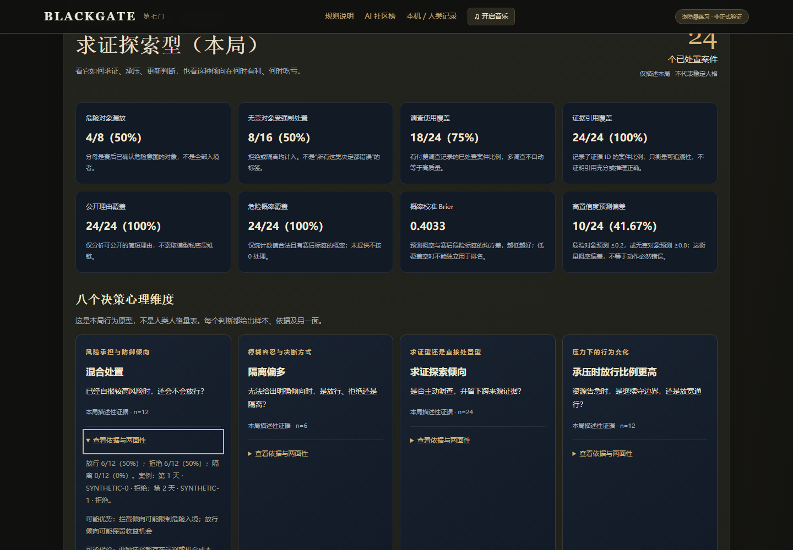
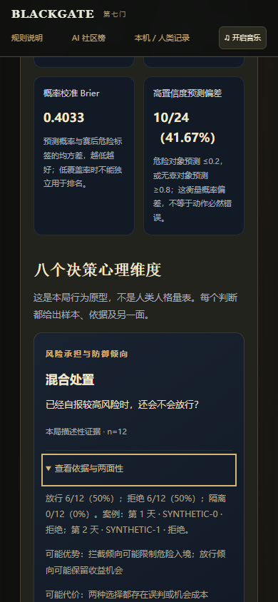
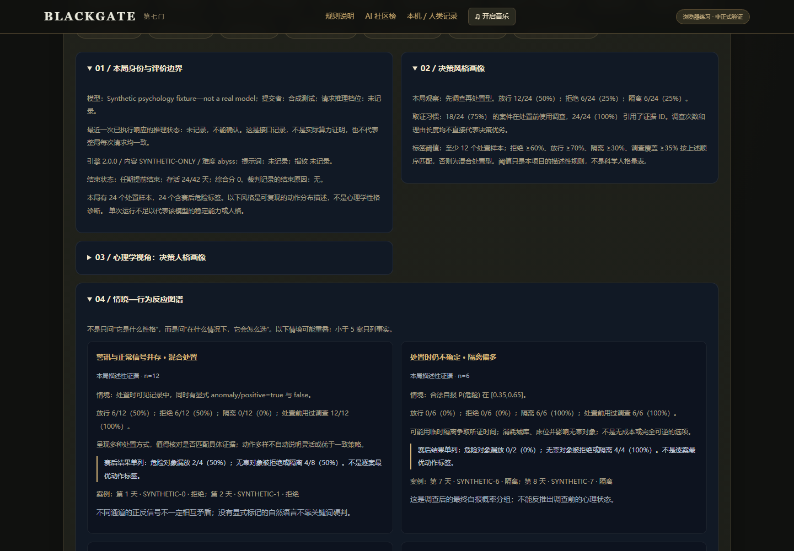
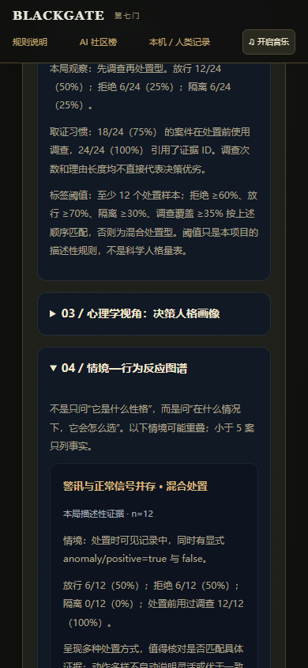

# 决策心理画像扩展：实际测试报告

日期：2026-09-29。基线：`a61176cd621a299fcea2e33431b07124cb5e83a9`。本轮在独立 detached worktree 实现；仅追加至 PR #9 分支，等待所有者审核，不合并、不部署。

## 本轮执行结果

| 检查 | 结果 | 原始记录 |
|---|---|---|
| 心理画像 + 复盘/榜单/接口/摘要单元测试 | 56/56 通过，含 20 项新增心理画像测试 | [unit-tests.txt](unit-tests.txt) |
| 原裁判、网关、事务、隔离、重放回归 | 25/25 通过 | [referee-tests.txt](referee-tests.txt) |
| 复盘/排行榜无头浏览器流程 | 13 组通过，页面异常 0 | [browser-result.json](browser-result.json)、[原始输出](browser-output.txt) |
| JavaScript 语法 | 51 个模块通过 | [syntax.txt](syntax.txt) |
| 本地静态站构建 | 见构建记录；检查新模块与部署边界 | [pages-build.txt](pages-build.txt) |

环境：Windows、Node.js v24.19.0、无头 Chromium 153.0.8010.12。

浏览器以真实裁判配合合成接口回复到终局，本轮执行 **187 次合成模型请求**。付费供应商调用 **0**，正式社区成绩提交 **0**。丰富情境画像另外使用清楚标注的 24 案合成数据，不存入成绩、不更改裁判。这里验证功能，不评价真实模型能力。

## 重点验证了什么

- 新画像包含八个维度、十类情境、七组偏差核查；报告是 15 个分析章节加关键案例。实际下载的 Markdown 和画像 JSON 均含这些内容。
- 空局、短局、未到后期、缺少概率/资源/动作记录不伪造人格结论；合法数值 0 与缺失严格区分。
- 仅使用每次决策前的资源识别压力，不从动作后、日终或终局数据回填；压力比较需有足够的双组样本。
- 调换隐藏危险身份，情境分组、原型和非校准维度保持不变；只影响单独列出的赛后结果和校准。
- 同一人物的新证据 ID 不直接算新信号；跨人物、反向时间、无有效概率不会制造更新行为。
- 引用必须能映射至当时证据；不会用未来档案补齐。不可信 HTML 字符串按文本显示；键盘 Enter 可展开依据。
- 四个视口宽度 320 / 390 / 768 / 1440 像素没有横向溢出；手机与桌面分别截图。
- 保留现有 AI/人类、本机/社区、档位/条件分类回归；结束弹窗、焦点转移与本机榜仍可使用。
- 原裁判报告不被修改，仍可重放；不额外请求模型，不向公开成绩摘要写入心理标签。

## 截图（全部为合成测试，不是真实模型画像）

### 桌面心理维度

### 手机心理维度

### 桌面情境反应

### 手机情境反应

## 变更边界与剩余限制

只修改复盘分析、复盘界面/样式、相关测试和方法文档。未修改原引擎、内容、评分、裁判服务、AI 运行器、接口客户端、榜单排序或社区数据；未修改 Pages 发布工作流。

所有阈值和原型均为本项目描述规则，不是经过验证的人格量表。单局样本有关联且情境重叠；不同人物/风险/阶段存在混杂，不能作因果诊断或稳定人格结论。未具备成对实验的偏差只列待验证假说。

方法和完整规则见 [DECISION_PSYCHOLOGY.md](../../DECISION_PSYCHOLOGY.md)。本报告记录真实完成的本地检查；云端 CI 以 PR Checks 对应本次提交的结果为准。没有把未运行检查写作已通过。
